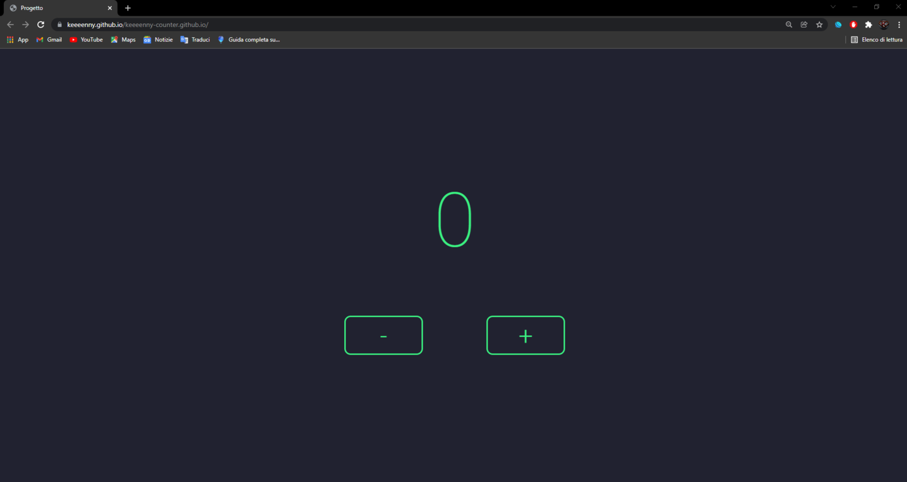

# Counter
> Progetto JavaScript Basics.

Il progetto è stato creato con l'obbiettivo di testare ciò che ho imparato in seguito allo studio della guida JavaScript Basics.  
L'obbiettivo, del progetto, è quello di creare un'applicazione che permetta all'utente di aumentare o diminuire il valore del counter a seguito dell'utilizzo di determinati pulsanti.

## Link

https://keeeenny.github.io/keeeenny-counter.github.io/
